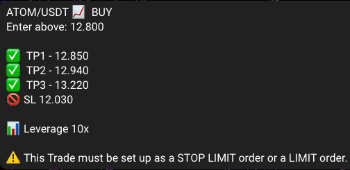

# Bot bybit

```
https://excalidraw.com/#room=768ac4b0d44b4cd3dd9a,q4d4_c1kbPPIurq-a1QmCg
```

#### Bot for make copy trading from signal telegram and send to Bybit the order
#### * Check the price of currency
#### * Change stop lost when tp
#### * Order can be cancel but not the position yet

# Environment Variables

To run this project, you will need to add the following environment variables to your .env file

## .env file
```bash
#manually
touch srcs/.env
#or
./configure
```
### add var
```bash
#telegram info bot
API_TELEGRAM = token_bot 
BOT_NAME = @your_bot_name

#telegram api compte
API_ID = api_id_telegram 
API_HASH = api_hash_telegram 

#api bybit and url for testnet or normal
API = api_bybit 
API_SECRET = api_secret_bybit 
URL = https://api-testnet.bybit.com

#channel telegram
SIGNAL_CHANNEL = @channel_where_get_signal or 1909090909 
ID_CHANNEL = @your_channel_to_print_signal_receive
```

# Installation 

### Please setting your .env
#### First run confirmation telegram api 
```bash
  #run ./configure for setting your .env and auth telegram
  make
```

#### Run app
```bash
  #run docker and start the app
  make
```

#### Stop app
```bash
  make down
```
## Signal exemple



## Authors

- [@waxdred](https://www.github.com/waxdred)

